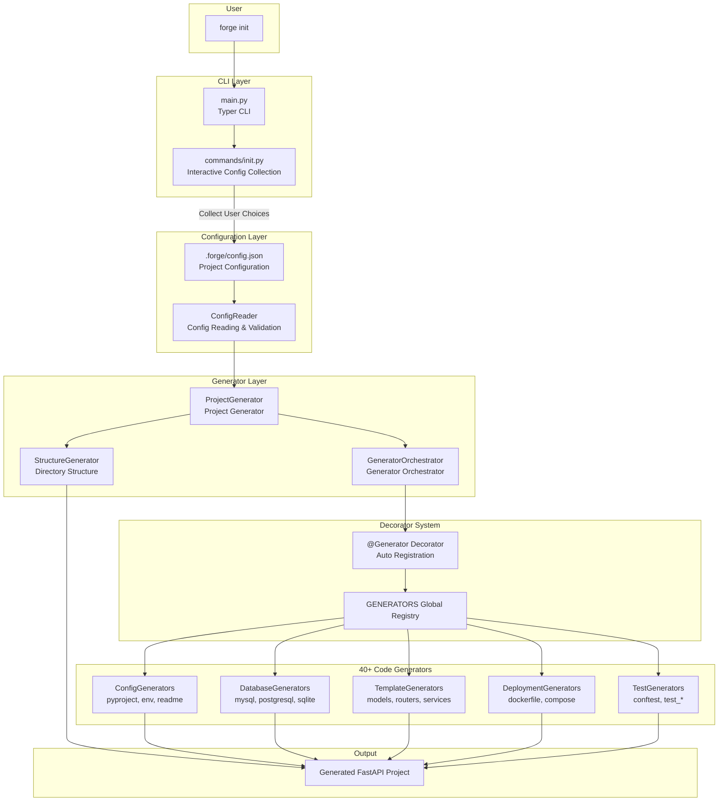
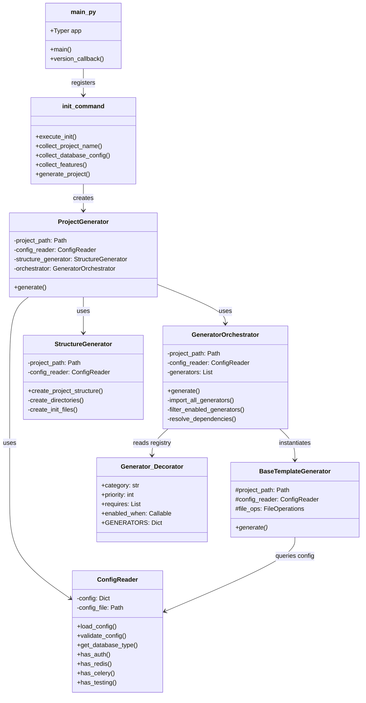
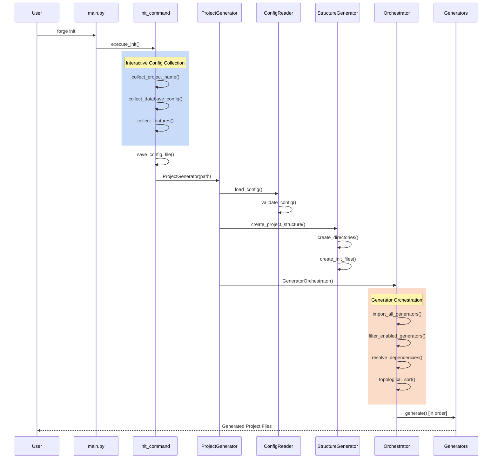
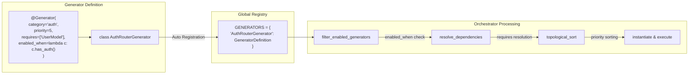
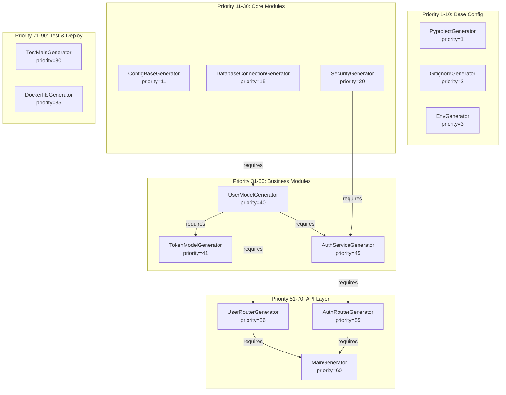
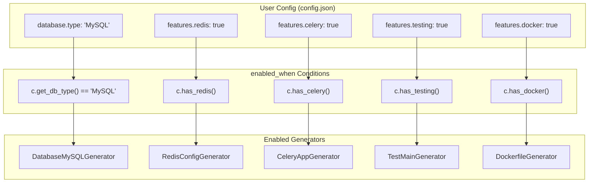
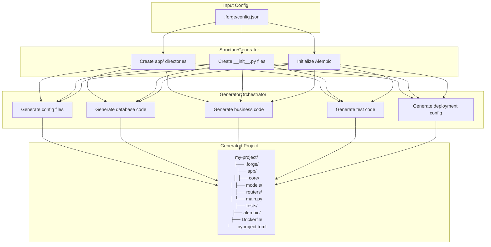
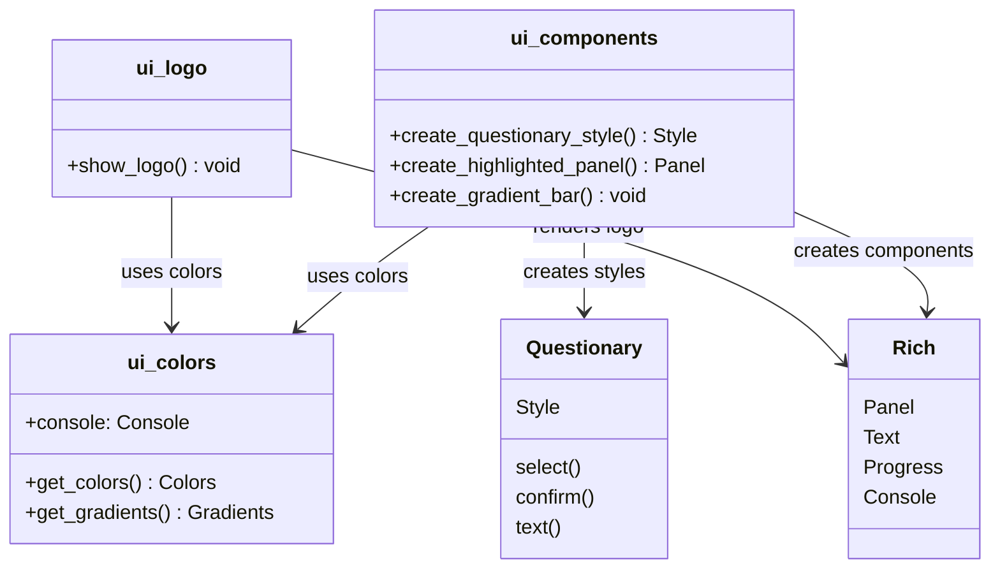

# Forge Architecture

## 1. Overall Flow

## 2. Core Component Relationships

## 3. Generator Execution Sequence

## 4. @Generator Decorator Mechanism

## 5. Generator Dependencies & Priority

## 6. Conditional Enabling Mechanism

## 7. Project Structure Generation

## 8. UI Component Structure

## Design Patterns Summary

| Pattern | Location | Description |
|---------|----------|-------------|
| **Decorator** | `@Generator` | Auto-registers generators to global registry |
| **Strategy** | Various Generators | Different generators for different DB/features |
| **Template Method** | `BaseTemplateGenerator` | Defines base class with `generate()` interface |
| **Dependency Injection** | `ConfigReader` | All generators share config reader instance |
| **Topological Sort** | `Orchestrator` | Resolves dependencies, determines execution order |
| **Configuration-First** | `.forge/config.json` | Save config first, then generate code based on it |
