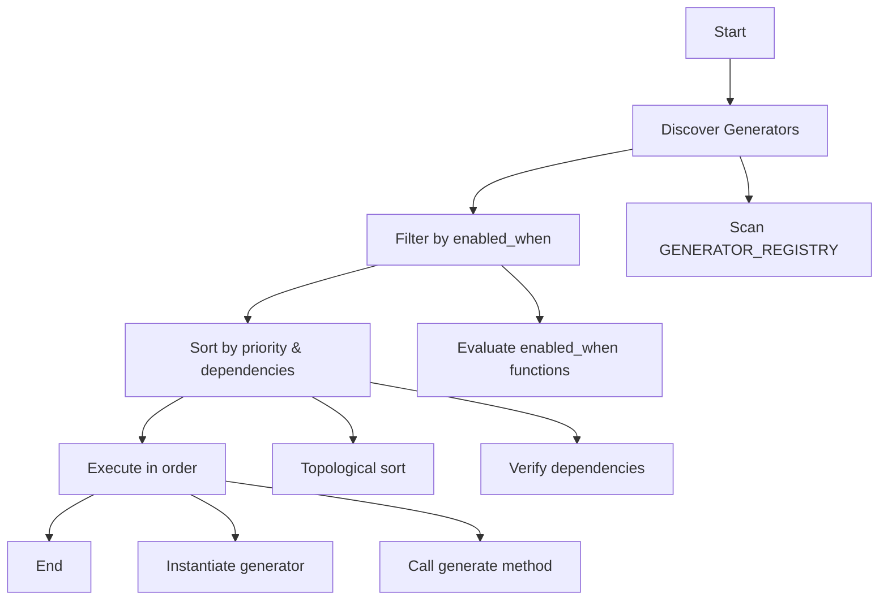

# Orchestrator API

The `GeneratorOrchestrator` is responsible for discovering, filtering, sorting, and executing generators in the correct order based on dependencies and priorities.

## Overview

```python
from core.generators.orchestrator import GeneratorOrchestrator
from core.config_reader import ConfigReader

config = ConfigReader.from_file(".forge/config.json")
orchestrator = GeneratorOrchestrator(config)
orchestrator.run()
```

## Class: GeneratorOrchestrator

### Constructor

```python
def __init__(self, config: ConfigReader):
    """
    Initialize orchestrator with configuration.
    
    Args:
        config: ConfigReader instance with project configuration
    """
```

**Example**:
```python
config = ConfigReader({
    "project_name": "my_api",
    "database": "postgresql",
    "auth_mode": "complete"
})
orchestrator = GeneratorOrchestrator(config)
```

### Methods

#### `discover_generators() -> list[dict]`

Discover all registered generators from the global registry.

**Returns**: List of generator metadata dictionaries

**Example**:
```python
generators = orchestrator.discover_generators()
for gen in generators:
    print(f"{gen['name']}: {gen['category']} (priority {gen['priority']})")
```

**Generator Metadata Structure**:
```python
{
    "name": "UserModelGenerator",
    "class": UserModelGenerator,
    "category": "model",
    "priority": 35,
    "requires": ["DatabaseGenerator"],
    "enabled_when": lambda c: c.has_auth()
}
```

#### `filter_generators(generators: list[dict]) -> list[dict]`

Filter generators based on `enabled_when` conditions.

**Args**:
- `generators`: List of generator metadata

**Returns**: Filtered list of enabled generators

**Example**:
```python
all_generators = orchestrator.discover_generators()
enabled_generators = orchestrator.filter_generators(all_generators)

print(f"Total generators: {len(all_generators)}")
print(f"Enabled generators: {len(enabled_generators)}")
```

**Filtering Logic**:
```python
def filter_generators(self, generators):
    filtered = []
    for gen in generators:
        if gen["enabled_when"] is None:
            # Always enabled
            filtered.append(gen)
        elif gen["enabled_when"](self.config):
            # Condition met
            filtered.append(gen)
        else:
            # Condition not met, skip
            pass
    return filtered
```

#### `sort_generators(generators: list[dict]) -> list[dict]`

Sort generators by priority and resolve dependencies.

**Args**:
- `generators`: List of generator metadata

**Returns**: Sorted list in execution order

**Raises**:
- `ValueError`: If circular dependencies detected
- `ValueError`: If required generator not found

**Example**:
```python
generators = orchestrator.discover_generators()
generators = orchestrator.filter_generators(generators)
sorted_generators = orchestrator.sort_generators(generators)

for i, gen in enumerate(sorted_generators, 1):
    print(f"{i}. {gen['name']} (priority {gen['priority']})")
```

**Sorting Algorithm**:
1. Sort by priority (ascending)
2. Perform topological sort based on dependencies
3. Verify no circular dependencies
4. Verify all required generators exist

#### `execute_generators(generators: list[dict]) -> None`

Execute generators in order.

**Args**:
- `generators`: Sorted list of generator metadata

**Example**:
```python
generators = orchestrator.discover_generators()
generators = orchestrator.filter_generators(generators)
generators = orchestrator.sort_generators(generators)
orchestrator.execute_generators(generators)
```

**Execution Process**:
```python
def execute_generators(self, generators):
    for gen_meta in generators:
        generator_class = gen_meta["class"]
        generator = generator_class(self.config)
        
        try:
            print(f"Generating {gen_meta['name']}...")
            generator.generate()
            print(f"✓ {gen_meta['name']} completed")
        except Exception as e:
            print(f"✗ {gen_meta['name']} failed: {e}")
            raise
```

#### `run() -> None`

Main entry point. Discovers, filters, sorts, and executes all generators.

**Example**:
```python
orchestrator = GeneratorOrchestrator(config)
orchestrator.run()  # Runs entire generation pipeline
```

**Equivalent to**:
```python
generators = orchestrator.discover_generators()
generators = orchestrator.filter_generators(generators)
generators = orchestrator.sort_generators(generators)
orchestrator.execute_generators(generators)
```

## Execution Flow



## Dependency Resolution

### Simple Dependencies

```python
@Generator(category="model", priority=35)
class UserModelGenerator(BaseTemplateGenerator):
    pass

@Generator(
    category="router",
    priority=60,
    requires=["UserModelGenerator"]  # Depends on UserModelGenerator
)
class UserRouterGenerator(BaseTemplateGenerator):
    pass
```

**Execution Order**: UserModelGenerator → UserRouterGenerator

### Multiple Dependencies

```python
@Generator(category="core", priority=15)
class DatabaseGenerator(BaseTemplateGenerator):
    pass

@Generator(category="core", priority=20)
class SecurityGenerator(BaseTemplateGenerator):
    pass

@Generator(
    category="service",
    priority=50,
    requires=["DatabaseGenerator", "SecurityGenerator"]
)
class AuthServiceGenerator(BaseTemplateGenerator):
    pass
```

**Execution Order**: DatabaseGenerator → SecurityGenerator → AuthServiceGenerator

### Transitive Dependencies

```python
@Generator(category="core", priority=15)
class DatabaseGenerator(BaseTemplateGenerator):
    pass

@Generator(
    category="model",
    priority=35,
    requires=["DatabaseGenerator"]
)
class UserModelGenerator(BaseTemplateGenerator):
    pass

@Generator(
    category="service",
    priority=50,
    requires=["UserModelGenerator"]  # Implicitly requires DatabaseGenerator
)
class UserServiceGenerator(BaseTemplateGenerator):
    pass
```

**Execution Order**: DatabaseGenerator → UserModelGenerator → UserServiceGenerator

### Circular Dependencies (Error)

```python
@Generator(
    category="model",
    priority=35,
    requires=["UserServiceGenerator"]  # ❌ Circular!
)
class UserModelGenerator(BaseTemplateGenerator):
    pass

@Generator(
    category="service",
    priority=50,
    requires=["UserModelGenerator"]  # ❌ Circular!
)
class UserServiceGenerator(BaseTemplateGenerator):
    pass
```

**Result**: `ValueError: Circular dependency detected`

## Conditional Execution

### Based on Configuration

```python
# Only runs if authentication is enabled
@Generator(
    category="model",
    priority=35,
    enabled_when=lambda c: c.has_auth()
)
class UserModelGenerator(BaseTemplateGenerator):
    pass

# Only runs if complete auth mode
@Generator(
    category="service",
    priority=50,
    enabled_when=lambda c: c.auth_mode() == "complete"
)
class EmailVerificationGenerator(BaseTemplateGenerator):
    pass
```

### Complex Conditions

```python
# Runs if Redis AND Celery are enabled
@Generator(
    category="task",
    priority=70,
    enabled_when=lambda c: c.use_redis() and c.use_celery()
)
class BackupTaskGenerator(BaseTemplateGenerator):
    pass

# Runs if auth is enabled OR tests are enabled
@Generator(
    category="test",
    priority=80,
    enabled_when=lambda c: c.has_auth() or c.include_tests()
)
class TestFixturesGenerator(BaseTemplateGenerator):
    pass
```

## Error Handling

### Missing Dependency

```python
@Generator(
    category="router",
    priority=60,
    requires=["NonExistentGenerator"]  # ❌ Doesn't exist
)
class MyRouterGenerator(BaseTemplateGenerator):
    pass
```

**Error**: `ValueError: Required generator 'NonExistentGenerator' not found`

### Generator Execution Failure

```python
@Generator(category="model", priority=35)
class BrokenGenerator(BaseTemplateGenerator):
    def generate(self):
        raise Exception("Something went wrong!")
```

**Behavior**:
- Error is caught and logged
- Execution stops
- Exception is re-raised
- Subsequent generators don't run

## Usage Examples

### Basic Usage

```python
from core.generators.orchestrator import GeneratorOrchestrator
from core.config_reader import ConfigReader

# Load configuration
config = ConfigReader.from_file(".forge/config.json")

# Create orchestrator
orchestrator = GeneratorOrchestrator(config)

# Run all generators
orchestrator.run()
```

### Custom Execution

```python
# Discover all generators
all_generators = orchestrator.discover_generators()
print(f"Found {len(all_generators)} generators")

# Filter enabled generators
enabled = orchestrator.filter_generators(all_generators)
print(f"{len(enabled)} generators enabled")

# Sort by dependencies
sorted_gens = orchestrator.sort_generators(enabled)

# Execute specific category
model_generators = [g for g in sorted_gens if g["category"] == "model"]
orchestrator.execute_generators(model_generators)
```

### Dry Run

```python
# Show what would be generated without actually generating
generators = orchestrator.discover_generators()
generators = orchestrator.filter_generators(generators)
generators = orchestrator.sort_generators(generators)

print("Execution plan:")
for i, gen in enumerate(generators, 1):
    deps = ", ".join(gen["requires"]) if gen["requires"] else "none"
    print(f"{i}. {gen['name']}")
    print(f"   Category: {gen['category']}")
    print(f"   Priority: {gen['priority']}")
    print(f"   Dependencies: {deps}")
    print()
```

### Selective Execution

```python
# Only run core generators
generators = orchestrator.discover_generators()
generators = orchestrator.filter_generators(generators)
generators = orchestrator.sort_generators(generators)

core_generators = [g for g in generators if g["category"] == "core"]
orchestrator.execute_generators(core_generators)
```

## Integration with ProjectGenerator

The orchestrator is typically called from `ProjectGenerator`:

```python
from core.project_generator import ProjectGenerator

class ProjectGenerator:
    def __init__(self, config: ConfigReader):
        self.config = config
        self.orchestrator = GeneratorOrchestrator(config)
    
    def generate(self):
        # Create project structure
        self._create_directories()
        
        # Run all generators
        self.orchestrator.run()
        
        # Post-generation tasks
        self._finalize()
```

## Performance Considerations

### Generator Count

- 40+ generators in typical Forge project
- Execution time: ~2-5 seconds
- Most time spent in file I/O

### Optimization Tips

1. **Minimize file writes**: Batch related content
2. **Cache configuration**: Don't re-read config in each generator
3. **Parallel execution**: Future enhancement (currently sequential)
4. **Skip unnecessary generators**: Use `enabled_when` effectively

## Debugging

### Enable Verbose Logging

```python
import logging

logging.basicConfig(level=logging.DEBUG)
logger = logging.getLogger("orchestrator")

# In orchestrator
logger.debug(f"Discovered {len(generators)} generators")
logger.debug(f"Filtered to {len(enabled)} generators")
logger.debug(f"Execution order: {[g['name'] for g in sorted_gens]}")
```

### Inspect Generator Registry

```python
from core.decorators.generator import GENERATOR_REGISTRY

print("Registered generators:")
for gen in GENERATOR_REGISTRY:
    print(f"- {gen['name']} ({gen['category']}, priority {gen['priority']})")
```

### Test Dependency Resolution

```python
def test_dependency_resolution():
    config = ConfigReader({"project_name": "test"})
    orchestrator = GeneratorOrchestrator(config)
    
    generators = orchestrator.discover_generators()
    sorted_gens = orchestrator.sort_generators(generators)
    
    # Verify order
    names = [g["name"] for g in sorted_gens]
    assert names.index("DatabaseGenerator") < names.index("UserModelGenerator")
    assert names.index("UserModelGenerator") < names.index("UserRouterGenerator")
```

## See Also

- [Generator Decorator API](generator-decorator.md) - Creating generators
- [ConfigReader API](config-reader.md) - Configuration access
- [Generator System Architecture](../architecture/generator-system.md) - System design
- [Creating Custom Generators](../developer-guide/creating-generators.md) - Tutorial
