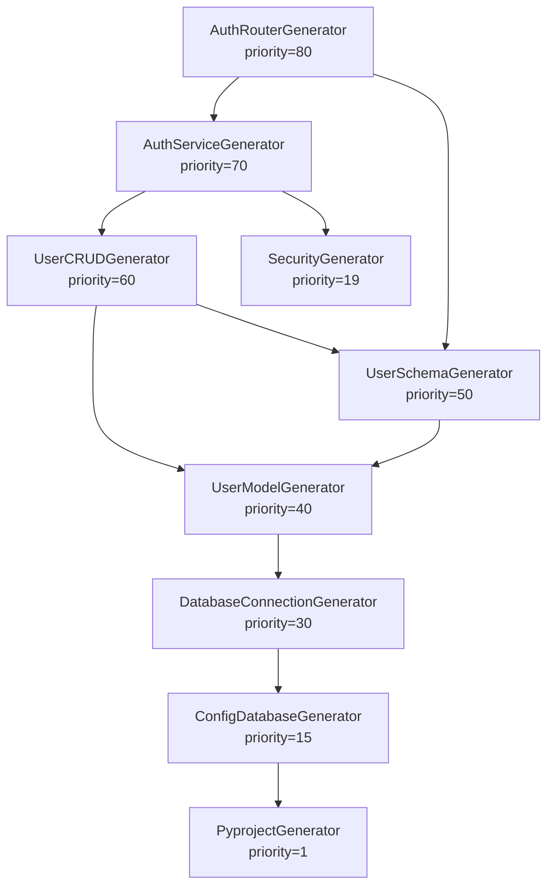

# Generator System

The generator system is the core of Forge. It uses a decorator-based registration pattern with automatic discovery, dependency resolution, and conditional execution.

## Components

### Global Registry

All generators are registered in a global dictionary:

```python
# core/decorators/generator.py
GENERATOR_REGISTRY = {}
```

The registry maps generator class names to their metadata:

```python
{
    "PyprojectGenerator": {
        "class": PyprojectGenerator,
        "category": "config",
        "priority": 1,
        "requires": [],
        "enabled_when": None,
        "description": "Generate pyproject.toml"
    },
    "UserModelGenerator": {
        "class": UserModelGenerator,
        "category": "model",
        "priority": 40,
        "requires": ["DatabaseConnectionGenerator"],
        "enabled_when": <function>,
        "description": "Generate user model"
    },
    # ... more generators
}
```

### @Generator Decorator

The decorator registers a class in the global registry:

```python
def Generator(
    category: str,
    priority: int,
    requires: list = None,
    enabled_when: callable = None,
    description: str = ""
):
    def decorator(cls):
        GENERATOR_REGISTRY[cls.__name__] = {
            "class": cls,
            "category": category,
            "priority": priority,
            "requires": requires or [],
            "enabled_when": enabled_when,
            "description": description,
        }
        return cls
    return decorator
```

### GeneratorOrchestrator

The orchestrator manages the generation process:

```python
class GeneratorOrchestrator:
    def __init__(self, project_path: Path, config_reader: ConfigReader):
        self.project_path = project_path
        self.config_reader = config_reader
    
    def execute_generators(self):
        # 1. Get all registered generators
        generators = self._discover_generators()
        
        # 2. Filter by enabled_when condition
        generators = self._filter_generators(generators)
        
        # 3. Sort by priority and dependencies
        generators = self._sort_generators(generators)
        
        # 4. Execute each generator
        for gen_info in generators:
            generator = gen_info["class"](
                self.project_path,
                self.config_reader
            )
            generator.generate()
```

## Execution Flow

### 1. Discovery

The orchestrator imports all generator modules to trigger registration:

```python
def _discover_generators(self):
    # Import all generator modules
    # This triggers @Generator decorators
    # which populate GENERATOR_REGISTRY
    
    return list(GENERATOR_REGISTRY.values())
```

Generators are discovered from:
- `core/generators/configs/`
- `core/generators/deployment/`
- `core/generators/templates/`

### 2. Filtering

Generators with `enabled_when` conditions are evaluated:

```python
def _filter_generators(self, generators):
    result = []
    for gen in generators:
        enabled_when = gen.get("enabled_when")
        
        if enabled_when is None:
            # No condition, always enabled
            result.append(gen)
        elif enabled_when(self.config_reader):
            # Condition returns True
            result.append(gen)
        # else: skip this generator
    
    return result
```

### 3. Sorting

Generators are sorted by:
1. Dependencies (topological sort)
2. Priority (lower numbers first)

```python
def _sort_generators(self, generators):
    # Build dependency graph
    graph = {}
    for gen in generators:
        name = gen["class"].__name__
        graph[name] = gen["requires"]
    
    # Topological sort
    sorted_names = topological_sort(graph)
    
    # Sort by priority within dependency order
    sorted_gens = sorted(
        generators,
        key=lambda g: (
            sorted_names.index(g["class"].__name__),
            g["priority"]
        )
    )
    
    return sorted_gens
```

### 4. Execution

Each generator is instantiated and executed:

```python
for gen_info in sorted_generators:
    generator_class = gen_info["class"]
    generator = generator_class(self.project_path, self.config_reader)
    generator.generate()
```

## Dependency Resolution

### Declaring Dependencies

Use the `requires` parameter to declare dependencies:

```python
@Generator(
    category="router",
    priority=80,
    requires=["UserModelGenerator", "UserSchemaGenerator"]
)
class UserRouterGenerator(BaseTemplateGenerator):
    ...
```

### Resolution Rules

1. **All dependencies must exist**: If a required generator doesn't exist, an error is raised
2. **Dependencies execute first**: A generator only runs after all its dependencies complete
3. **No circular dependencies**: A → B → A is not allowed

### Example Dependency Chain



This diagram shows the authentication-related generator chain. The orchestrator ensures generators execute in the correct order based on both dependencies and priorities.

## Conditional Execution

### Using enabled_when

The `enabled_when` parameter accepts a function that receives a `ConfigReader`:

```python
@Generator(
    category="router",
    priority=80,
    enabled_when=lambda c: c.has_auth()
)
class AuthRouterGenerator(BaseTemplateGenerator):
    ...
```

### Common Conditions

```python
# Feature flags
enabled_when=lambda c: c.has_auth()
enabled_when=lambda c: c.has_redis()
enabled_when=lambda c: c.has_celery()
enabled_when=lambda c: c.has_testing()
enabled_when=lambda c: c.has_docker()
enabled_when=lambda c: c.has_migration()

# Specific values
enabled_when=lambda c: c.get_auth_type() == "complete"
enabled_when=lambda c: c.get_database_type() == "PostgreSQL"
enabled_when=lambda c: c.get_orm_type() == "SQLModel"

# Combined conditions
enabled_when=lambda c: c.has_auth() and c.get_auth_type() == "complete"
enabled_when=lambda c: c.has_celery() and c.has_redis()
```

### Conditional Dependencies

When a generator depends on a conditionally-enabled generator, both conditions must be met:

```python
@Generator(
    category="test",
    priority=112,
    requires=["AuthRouterGenerator"],
    enabled_when=lambda c: c.has_testing() and c.has_auth()
)
class TestAuthGenerator(BaseTemplateGenerator):
    ...
```

## Generator Implementation

### Base Class

All generators inherit from `BaseTemplateGenerator`:

```python
class BaseTemplateGenerator:
    def __init__(self, project_path: Path, config_reader: ConfigReader):
        self.project_path = Path(project_path)
        self.config_reader = config_reader
        self.file_ops = FileOperations(base_path=project_path)
    
    def generate(self) -> None:
        raise NotImplementedError
```

### Implementation Pattern

```python
@Generator(
    category="model",
    priority=40,
    requires=["DatabaseConnectionGenerator"],
    enabled_when=lambda c: c.has_auth(),
    description="Generate user model"
)
class UserModelGenerator(BaseTemplateGenerator):
    def generate(self) -> None:
        # 1. Read configuration
        orm_type = self.config_reader.get_orm_type()
        auth_type = self.config_reader.get_auth_type()
        
        # 2. Build content based on configuration
        if orm_type == "SQLModel":
            content = self._build_sqlmodel_user(auth_type)
        else:
            content = self._build_sqlalchemy_user(auth_type)
        
        # 3. Write file
        self.file_ops.create_python_file(
            file_path="app/models/user.py",
            docstring="User model",
            imports=imports,
            content=content,
            overwrite=True
        )
    
    def _build_sqlmodel_user(self, auth_type: str) -> str:
        # Build SQLModel user class
        ...
    
    def _build_sqlalchemy_user(self, auth_type: str) -> str:
        # Build SQLAlchemy user class
        ...
```

## Current Generators

Forge includes approximately 50 generators organized by category:

| Category | Count | Examples |
|----------|-------|----------|
| config | 6 | pyproject, env, gitignore, readme, license |
| app_config | 8 | settings, database config, jwt config, cors |
| database | 4 | connection, postgresql, mysql, sqlite |
| model | 2 | user, token |
| schema | 2 | user, token |
| crud | 2 | user, token |
| service | 1 | auth |
| router | 2 | auth, user |
| email | 2 | email service, email template |
| task | 2 | tasks init, backup database |
| test | 4 | conftest, test_main, test_auth, test_users |
| deployment | 3 | dockerfile, docker-compose, dockerignore |
| migration | 1 | alembic |
| app | 6 | main, security, redis, celery, logger, deps |
