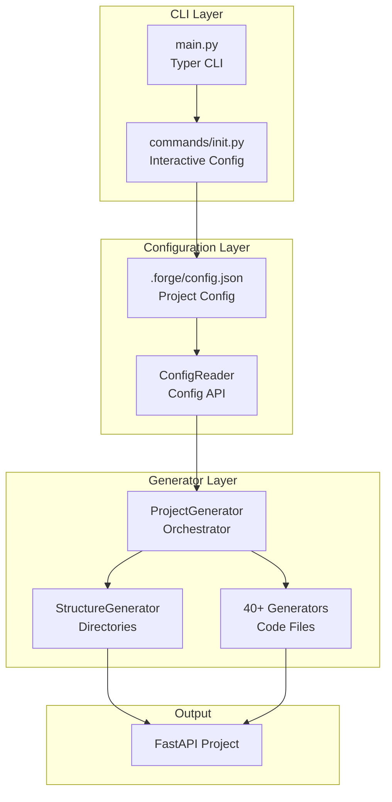
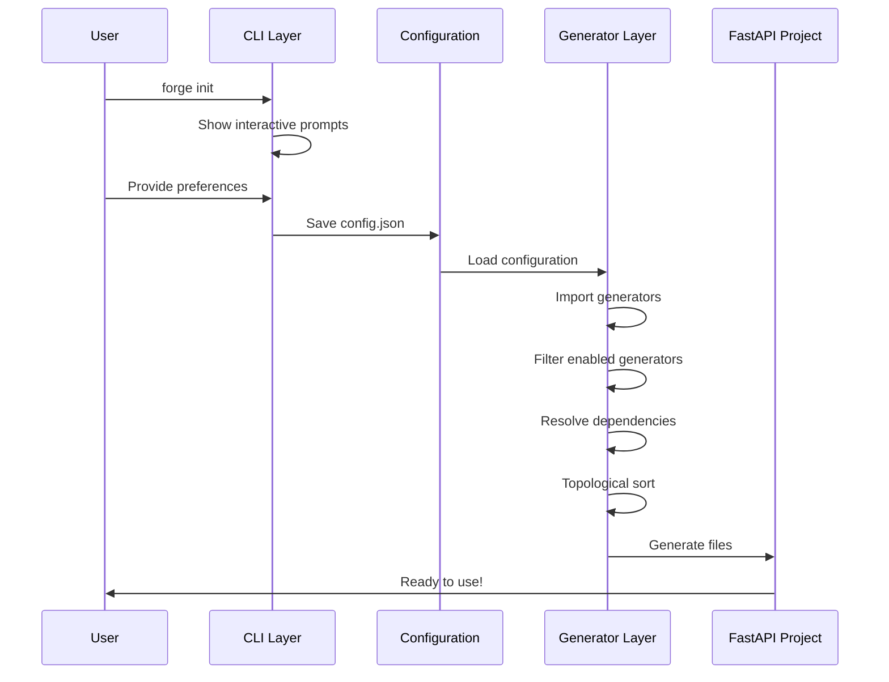

# Architecture Overview

Forge follows a **Configuration-First** design principle with a **dynamic generator system** that enables automatic code generation based on user preferences.

## Design Philosophy

### 1. Configuration-First

Instead of immediately generating code, Forge:

1. **Collects** user preferences through interactive prompts
2. **Saves** configuration to `.forge/config.json` first
3. **Generates** code based on saved configuration

This approach provides:

- ✅ **Traceability** - All decisions are documented
- ✅ **Reproducibility** - Easy to regenerate projects
- ✅ **Transparency** - Clear view of what's included
- ✅ **Flexibility** - Configuration can be shared and modified

### 2. Dynamic Generator System

Forge uses a decorator-based system for:

- **Automatic Discovery** - Generators register themselves
- **Dependency Resolution** - Correct execution order
- **Conditional Execution** - Only enabled generators run
- **Easy Extension** - Add new generators by creating files

## Architecture Layers



## Component Overview

### 1. CLI Layer

**Purpose**: User interface and command handling

**Components**:

- `main.py` - Entry point with Typer CLI
- `commands/init.py` - Interactive project initialization
- `ui/` - Beautiful terminal UI components

**Key Features**:

- Interactive prompts with Questionary
- Rich terminal output with gradients
- Input validation and error handling

### 2. Configuration Layer

**Purpose**: Store and validate user preferences

**Components**:

- `.forge/config.json` - Configuration storage
- `core/config_reader.py` - Configuration API

**Configuration Structure**:

```json
{
  "project_name": "my-project",
  "database": {
    "type": "postgresql",
    "orm": "sqlmodel",
    "migration_tool": "alembic"
  },
  "features": {
    "auth": {
      "type": "complete",
      "refresh_token": true
    },
    "cors": true,
    "dev_tools": "standard",
    "testing": true,
    "redis": true,
    "celery": true,
    "docker": true
  },
  "metadata": {
    "created_at": "2024-01-17T10:00:00",
    "forge_version": "0.1.8.3"
  }
}
```

### 3. Generator Layer

**Purpose**: Generate project files based on configuration

**Components**:

- `ProjectGenerator` - Main coordinator
- `StructureGenerator` - Creates directory structure
- `GeneratorOrchestrator` - Manages code generators
- `@Generator` Decorator - Auto-registration system
- 40+ specialized generators

## Execution Flow



### Detailed Steps

1. **Initialization**
   ```python
   forge init my-project
   ```

2. **Interactive Configuration**
   - Collect project name
   - Select database type and ORM
   - Choose authentication type
   - Enable/disable features

3. **Save Configuration**
   ```python
   config = {
       "project_name": "my-project",
       "database": {...},
       "features": {...}
   }
   save_to(".forge/config.json")
   ```

4. **Load and Validate**
   ```python
   config_reader = ConfigReader(project_path)
   config_reader.load_config()
   config_reader.validate_config()
   ```

5. **Create Structure**
   ```python
   structure_gen = StructureGenerator(path, config)
   structure_gen.create_project_structure()
   ```

6. **Discover Generators**
   ```python
   # Automatically imports all generator modules
   # Each @Generator decorator registers itself
   orchestrator._import_all_generators()
   ```

7. **Filter Generators**
   ```python
   # Only keep enabled generators
   enabled = [
       gen for gen in GENERATORS.values()
       if gen.enabled_when(config_reader)
   ]
   ```

8. **Resolve Dependencies**
   ```python
   # Topological sort based on 'requires'
   sorted_gens = orchestrator._resolve_dependencies()
   ```

9. **Generate Files**
   ```python
   for gen in sorted_generators:
       gen_instance = gen.generator_class(path, config)
       gen_instance.generate()
   ```

## Key Design Patterns

### 1. Decorator Pattern

The `@Generator` decorator enables automatic registration:

```python
@Generator(
    category="auth",
    priority=45,
    requires=["UserModelGenerator"],
    enabled_when=lambda c: c.has_auth()
)
class AuthServiceGenerator(BaseTemplateGenerator):
    def generate(self):
        # Generate auth service code
        ...
```

### 2. Strategy Pattern

Different generators for different database types:

```python
# core/generators/templates/database/
mysql.py          # MySQL-specific code
postgresql.py     # PostgreSQL-specific code
sqlite.py         # SQLite-specific code
```

Each implements the same interface but generates database-specific code.

### 3. Template Method Pattern

Base class defines the structure:

```python
class BaseTemplateGenerator:
    def __init__(self, project_path, config_reader):
        self.project_path = project_path
        self.config_reader = config_reader
    
    def generate(self):
        # To be implemented by subclasses
        raise NotImplementedError
```

### 4. Dependency Injection

Configuration is injected into all generators:

```python
generator = AuthServiceGenerator(
    project_path=path,
    config_reader=config_reader  # Injected
)
```

### 5. Topological Sorting

Ensures generators execute in correct order:

```python
# UserModelGenerator must run before AuthServiceGenerator
@Generator(requires=["UserModelGenerator"])
class AuthServiceGenerator:
    ...
```

## Generator Categories

Generators are organized by category:

| Category | Purpose | Examples |
|----------|---------|----------|
| **config** | Project configuration files | `pyproject.toml`, `.env`, `README.md` |
| **database** | Database connection and setup | MySQL, PostgreSQL, SQLite connection |
| **model** | Database models | User model, Token model |
| **schema** | Pydantic schemas | User schemas, Token schemas |
| **crud** | Database operations | User CRUD, Token CRUD |
| **service** | Business logic | Auth service, Email service |
| **router** | API endpoints | Auth router, User router |
| **security** | Security utilities | JWT, password hashing |
| **middleware** | Middleware components | CORS, rate limiting |
| **task** | Background tasks | Database backup, email tasks |
| **test** | Test files | API tests, unit tests |
| **deployment** | Deployment configs | Dockerfile, docker-compose.yml |

## Priority System

Generators execute in priority order (1-100):

| Priority Range | Purpose |
|----------------|---------|
| 1-10 | Base configuration files |
| 11-30 | Core modules (database, security) |
| 31-50 | Business layer (models, services) |
| 51-70 | API layer (routers, main app) |
| 71-90 | Tests and deployment |

## Extensibility

The architecture is designed for easy extension:

### Adding a New Generator

1. Create a new file in appropriate category
2. Use `@Generator` decorator
3. Implement `generate()` method
4. Done! It's automatically discovered

Example:

```python
# core/generators/templates/notifications/email.py

from core.decorators import Generator
from core.generators.base import BaseTemplateGenerator

@Generator(
    category="notification",
    priority=50,
    requires=["ConfigGenerator"],
    enabled_when=lambda c: c.has_email()
)
class EmailNotificationGenerator(BaseTemplateGenerator):
    def generate(self):
        # Generate email notification code
        self.create_file("app/notifications/email.py", content)
```

No manual registration needed!

## Benefits

This architecture provides:

1. **Modularity** - Each generator is independent
2. **Testability** - Each component can be tested separately
3. **Maintainability** - Clear separation of concerns
4. **Extensibility** - Easy to add new generators
5. **Reliability** - Dependency resolution prevents errors
6. **Transparency** - Configuration is visible and editable

## Learn More

- [Generator System](generator-system.md) - Deep dive into generators
- [Configuration Options](../user-guide/configuration.md) - Configuration design
- [First Project](../getting-started/first-project.md) - Generated project layout
