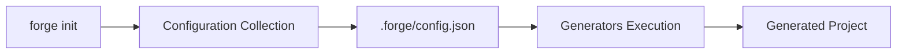
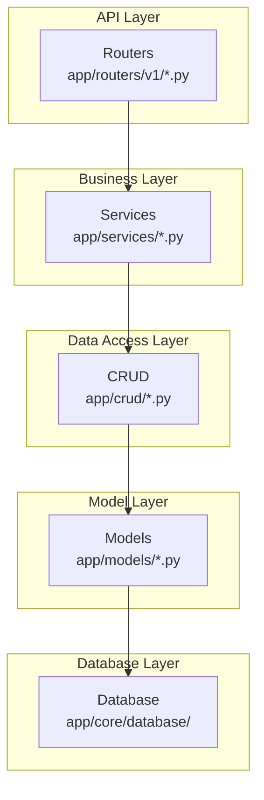

# Architecture Overview

Forge follows a configuration-first design where user preferences drive code generation through a modular generator system.

## High-Level Flow



The generation process follows these steps:

1. User runs `forge init`
2. Interactive prompts collect preferences
3. Configuration saved to `.forge/config.json`
4. `ProjectGenerator` reads configuration
5. `StructureGenerator` creates directories
6. `GeneratorOrchestrator` discovers and executes generators
7. Each generator creates specific files

## Core Components

### CLI Layer

**main.py**: Entry point using Typer framework

```python
app = typer.Typer(name="forge")
app.command(name="init")(init_command)
```

**commands/init.py**: Interactive configuration collection using questionary

- Collects project name
- Database and ORM selection
- Feature toggles (auth, Redis, Celery, etc.)
- Saves configuration to `.forge/config.json`

### Configuration Layer

**ConfigReader** (`core/config_reader.py`): Reads and validates configuration

```python
class ConfigReader:
    def __init__(self, project_path: Path):
        self.config = self._load_config()
    
    def get_project_name(self) -> str: ...
    def get_database_type(self) -> str: ...
    def has_auth(self) -> bool: ...
    def has_redis(self) -> bool: ...
```

Provides a clean API for generators to query configuration without parsing JSON directly.

### Generation Layer

**ProjectGenerator** (`core/project_generator.py`): Coordinates generation

```python
class ProjectGenerator:
    def generate(self):
        # 1. Create directory structure
        self.structure_generator.create_project_structure()
        
        # 2. Execute all generators
        self.orchestrator.execute_generators()
```

**StructureGenerator** (`core/generators/structure.py`): Creates directories

- Creates `app/`, `app/core/`, `app/models/`, etc.
- Creates `__init__.py` files
- Initializes Alembic if migrations enabled

**GeneratorOrchestrator** (`core/generators/orchestrator.py`): Manages generators

- Discovers all registered generators
- Filters based on configuration
- Resolves dependencies
- Sorts by priority
- Executes in order

### Generator Layer

**@Generator Decorator** (`core/decorators/generator.py`): Registers generators

```python
GENERATOR_REGISTRY = {}

def Generator(category, priority, requires=None, enabled_when=None, description=""):
    def decorator(cls):
        GENERATOR_REGISTRY[cls.__name__] = {
            "class": cls,
            "category": category,
            "priority": priority,
            "requires": requires or [],
            "enabled_when": enabled_when,
            "description": description,
        }
        return cls
    return decorator
```

**BaseTemplateGenerator** (`core/generators/templates/base.py`): Base class

```python
class BaseTemplateGenerator:
    def __init__(self, project_path: Path, config_reader: ConfigReader):
        self.project_path = project_path
        self.config_reader = config_reader
        self.file_ops = FileOperations(base_path=project_path)
    
    def generate(self) -> None:
        raise NotImplementedError
```

### Utility Layer

**FileOperations** (`core/utils/file_operations.py`): File writing utilities

- `create_file()`: Create any file
- `create_python_file()`: Create Python file with docstring and imports
- `create_json_file()`: Create JSON file
- `create_markdown_file()`: Create Markdown file

## Generator Categories

Generators are organized by category and priority:

| Category | Priority | Examples |
|----------|----------|----------|
| config | 1-10 | pyproject.toml, .env, .gitignore |
| app_config | 11-20 | Settings modules |
| database | 21-30 | Database connection |
| model | 31-50 | User model, Token model |
| schema | 51-60 | Pydantic schemas |
| crud | 61-70 | CRUD operations |
| service | 71-80 | Auth service |
| router | 81-90 | API routes |
| test | 100-115 | Test files |
| deployment | 100-110 | Dockerfile, docker-compose |
| migration | 120 | Alembic configuration |

## Dependency Resolution

Generators declare dependencies via the `requires` parameter:

```python
@Generator(
    category="router",
    priority=80,
    requires=["UserModelGenerator", "UserSchemaGenerator", "UserCRUDGenerator"]
)
class UserRouterGenerator(BaseTemplateGenerator):
    ...
```

The orchestrator builds a dependency graph and ensures:
1. All required generators exist
2. No circular dependencies
3. Dependencies execute before dependents

## Conditional Generation

Generators use `enabled_when` to conditionally execute:

```python
@Generator(
    category="router",
    priority=80,
    enabled_when=lambda c: c.has_auth()
)
class AuthRouterGenerator(BaseTemplateGenerator):
    ...
```

The orchestrator evaluates these conditions against the `ConfigReader` and skips disabled generators.

## Generated Project Architecture

The generated FastAPI project follows a layered architecture:



- **Routers**: Handle HTTP requests, validate input, return responses
- **Services**: Business logic, orchestrate operations
- **CRUD**: Database operations (Create, Read, Update, Delete)
- **Models**: Database table definitions
- **Database**: Connection management, session handling

This separation allows:
- Easy testing (mock lower layers)
- Clear responsibilities
- Reusable components
