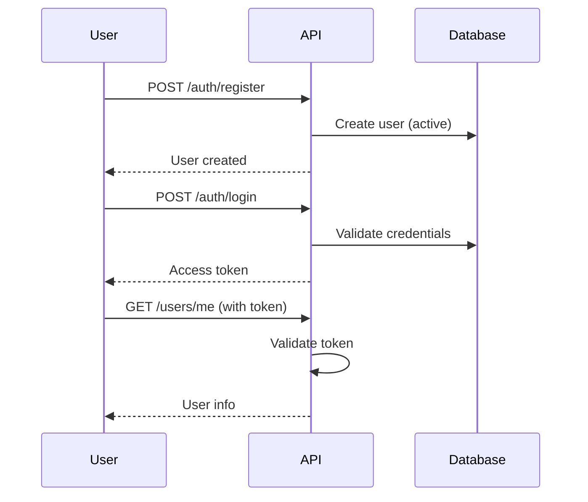
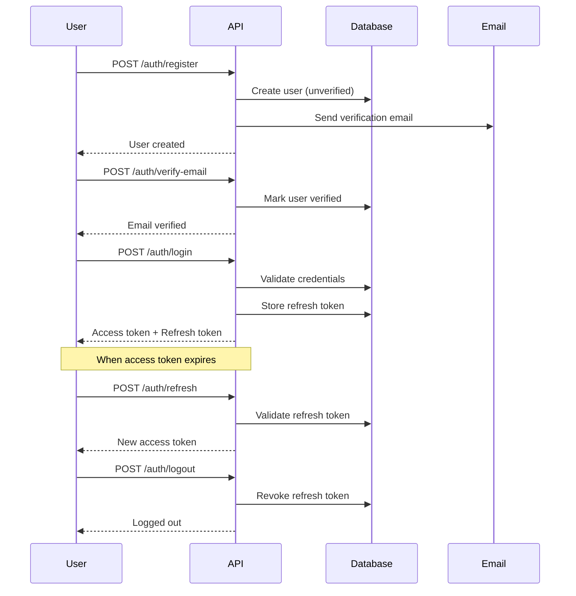
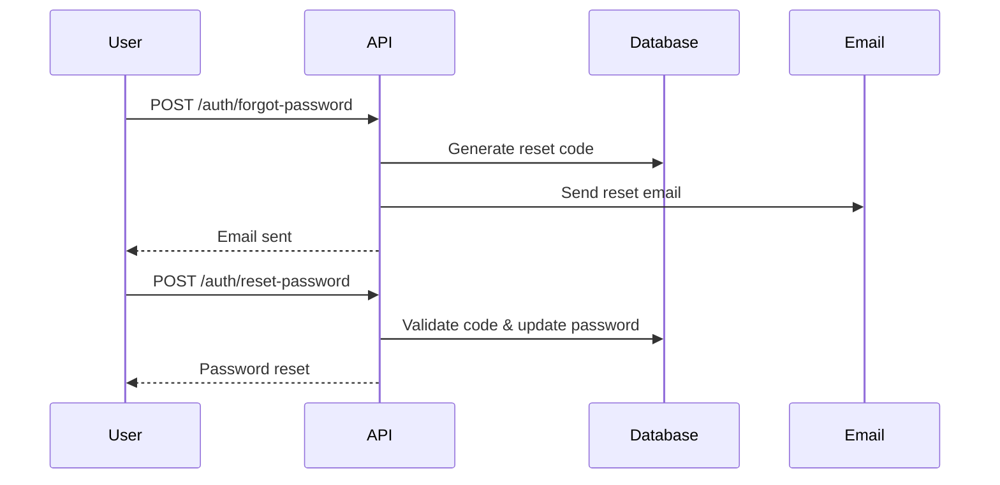

# Authentication

Forge provides two authentication modes: Basic JWT Auth and Complete JWT Auth. Both use JSON Web Tokens for stateless authentication.

## Authentication Types

### Basic JWT Auth

A simple JWT implementation suitable for internal APIs or when you handle email verification separately:

- User registration
- User login with access token
- Protected route access
- Current user endpoint

### Complete JWT Auth

A full-featured authentication system for production applications:

- Everything in Basic, plus:
- Email verification after registration
- Refresh token rotation
- Password reset via email
- Multi-device session management
- Device tracking and logout

## Security Components

### Password Hashing

Forge uses Argon2 for password hashing, the winner of the Password Hashing Competition:

```python
from app.core.security import get_password_hash, verify_password

# Hash a password
hashed = get_password_hash("user_password")

# Verify a password
is_valid = verify_password("user_password", hashed)
```

### Password Validation

The `PasswordValidator` class enforces password strength:

- Minimum 8 characters
- At least one uppercase letter
- At least one lowercase letter
- At least one digit
- At least one special character

### JWT Tokens

The `JWTManager` handles token creation and validation:

```python
from app.core.security import security_manager

# Create access token
token, expires_at = security_manager.create_access_token({
    "sub": user.username,
    "user_id": user.id
})

# Create refresh token (Complete Auth only)
refresh_token, expires_at = security_manager.create_refresh_token({
    "sub": user.username,
    "user_id": user.id
})

# Decode and validate token
payload = security_manager.decode_token(token)
```

## API Endpoints

### Basic JWT Auth Endpoints

| Method | Endpoint | Description |
|--------|----------|-------------|
| POST | `/api/v1/auth/register` | Register new user |
| POST | `/api/v1/auth/login` | Login and get access token |
| GET | `/api/v1/users/me` | Get current user info |

### Complete JWT Auth Endpoints

All Basic endpoints, plus:

| Method | Endpoint | Description |
|--------|----------|-------------|
| POST | `/api/v1/auth/verify-email` | Verify email with code |
| POST | `/api/v1/auth/resend-verification` | Resend verification email |
| POST | `/api/v1/auth/refresh` | Refresh access token |
| POST | `/api/v1/auth/logout` | Logout (revoke refresh token) |
| POST | `/api/v1/auth/logout-all` | Logout all devices |
| POST | `/api/v1/auth/forgot-password` | Request password reset |
| POST | `/api/v1/auth/reset-password` | Reset password with code |
| POST | `/api/v1/auth/change-password` | Change password (authenticated) |
| GET | `/api/v1/auth/devices` | List logged-in devices |

## Authentication Flow

### Basic Auth Flow



### Complete Auth Flow



### Password Reset Flow



## Using Authentication in Routes

### Protecting Routes

Use the `get_current_user` dependency:

```python
from fastapi import Depends
from app.core.deps import get_current_user
from app.models.user import User

@router.get("/protected")
async def protected_route(current_user: User = Depends(get_current_user)):
    return {"message": f"Hello, {current_user.username}"}
```

### Optional Authentication

For routes that work with or without authentication:

```python
from typing import Optional

@router.get("/public")
async def public_route(
    current_user: Optional[User] = Depends(get_current_user_optional)
):
    if current_user:
        return {"message": f"Hello, {current_user.username}"}
    return {"message": "Hello, guest"}
```

## Email Configuration

Complete JWT Auth requires email configuration for verification and password reset:

```bash
EMAIL_HOST=smtp.gmail.com
EMAIL_PORT=587
EMAIL_HOST_USER=your-email@gmail.com
EMAIL_HOST_PASSWORD=your-app-password
EMAIL_USE_TLS=true
EMAIL_FROM_NAME="My App"
EMAIL_FROM_EMAIL=noreply@myapp.com
EMAIL_EXPIRATION=3600  # Verification code expiry in seconds
```

### Email Templates

Email templates are stored in `static/email_template/`:

- `verification.html` - Email verification
- `password_reset.html` - Password reset
- `welcome.html` - Welcome email after verification

Templates use Jinja2 syntax with variables like `{{ username }}`, `{{ code }}`, `{{ expiration_minutes }}`.

## JWT Configuration

```bash
JWT_SECRET_KEY=your-secret-key-at-least-32-characters
JWT_ALGORITHM=HS256
JWT_ACCESS_TOKEN_EXPIRATION=1800      # 30 minutes
JWT_REFRESH_TOKEN_EXPIRATION=86400    # 24 hours (Complete Auth)
JWT_ISSUER=my-app
JWT_AUDIENCE=my-app_users
```

### Token Payload

Access tokens contain:

```json
{
  "sub": "username",
  "user_id": 1,
  "exp": 1234567890,
  "iss": "my-app",
  "aud": "my-app_users",
  "token_type": "access"
}
```

## Database Models

### User Model

```python
class User(SQLModel, table=True):
    id: Optional[int] = Field(primary_key=True)
    username: str = Field(unique=True, index=True)
    email: str = Field(unique=True, index=True)
    hashed_password: str
    is_active: bool = Field(default=True)
    is_verified: bool = Field(default=False)  # Complete Auth only
    is_superuser: bool = Field(default=False)
    created_at: datetime
    updated_at: datetime
    last_login_at: Optional[datetime]  # Complete Auth only
```

### RefreshToken Model (Complete Auth)

```python
class RefreshToken(SQLModel, table=True):
    id: Optional[int] = Field(primary_key=True)
    user_id: int = Field(foreign_key="users.id")
    token: str = Field(unique=True, index=True)
    expires_at: datetime
    is_revoked: bool = Field(default=False)
    device_name: Optional[str]
    device_type: Optional[str]
    ip_address: Optional[str]
    user_agent: Optional[str]
    created_at: datetime
    last_used_at: Optional[datetime]
```

### VerificationCode Model (Complete Auth)

```python
class VerificationCode(SQLModel, table=True):
    id: Optional[int] = Field(primary_key=True)
    user_id: int = Field(foreign_key="users.id")
    code: str = Field(index=True)
    code_type: str  # "email_verification" or "password_reset"
    expires_at: datetime
    is_used: bool = Field(default=False)
    created_at: datetime
```

## Security Best Practices

1. **Use strong JWT secrets**: At least 32 characters, randomly generated
2. **Keep token expiration short**: 15-30 minutes for access tokens
3. **Rotate refresh tokens**: Issue new refresh token on each use
4. **Use HTTPS**: Always in production
5. **Validate email**: Require email verification before allowing login
6. **Rate limit**: Implement rate limiting on auth endpoints
7. **Log auth events**: Track login attempts, password changes
