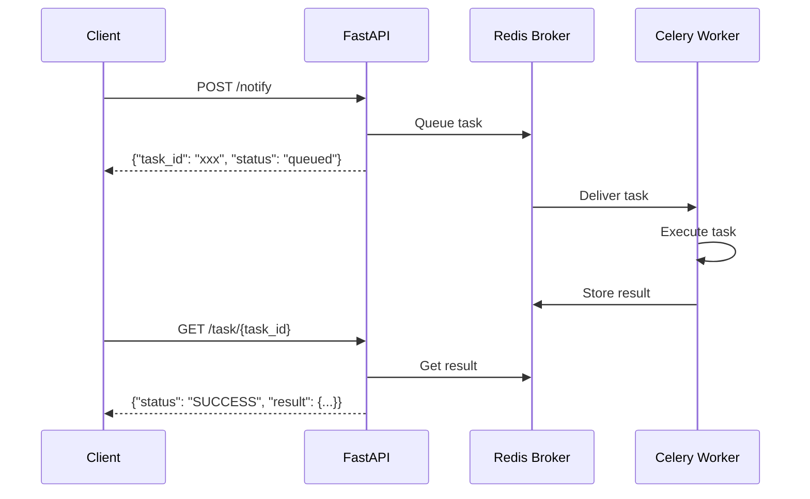

# Celery Background Tasks

Celery enables asynchronous task processing and scheduled jobs. Forge generates a complete Celery setup with Redis as the message broker.

## Prerequisites

Celery requires Redis. When you enable Celery during project creation, Redis is automatically enabled as well.

## Configuration

Configure Celery via environment variables:

```bash
CELERY_BROKER_URL=redis://localhost:6379/1
CELERY_RESULT_BACKEND=redis://localhost:6379/2
CELERY_TASK_SERIALIZER=json
CELERY_RESULT_SERIALIZER=json
CELERY_TIMEZONE=UTC
CELERY_ENABLE_UTC=true
CELERY_WORKER_CONCURRENCY=4
```

## Celery Application

The Celery app is configured in `app/core/celery.py`:

```python
from celery import Celery
from app.core.config.settings import settings

celery_app = Celery(
    "app",
    broker=settings.celery.CELERY_BROKER_URL,
    backend=settings.celery.CELERY_RESULT_BACKEND,
)

celery_app.autodiscover_tasks(packages=["app.tasks"])
```

## Writing Tasks

### Basic Task

Create tasks in `app/tasks/`:

```python
# app/tasks/example_task.py
from app.core.celery import celery_app

@celery_app.task
def send_notification(user_id: int, message: str):
    # Task logic here
    print(f"Sending notification to user {user_id}: {message}")
    return {"status": "sent", "user_id": user_id}
```

### Task with Database Access

Use the `with_db_init` decorator for tasks that need database access:

```python
from app.core.celery import celery_app, with_db_init

@celery_app.task
@with_db_init
def process_user_data(user_id: int):
    # Database is initialized before this runs
    # Use sync database operations here
    pass
```

The `with_db_init` decorator initializes the database connection for the Celery worker process, which runs separately from the FastAPI application.

### Task with Retry

Configure automatic retries for tasks that may fail:

```python
@celery_app.task(
    bind=True,
    max_retries=3,
    default_retry_delay=300,  # 5 minutes
)
def unreliable_task(self, data: dict):
    try:
        # Task logic
        pass
    except Exception as e:
        # Retry on failure
        raise self.retry(exc=e)
```

## Calling Tasks

### Task Execution Flow



### Async Execution

Call tasks asynchronously from your FastAPI routes:

```python
from app.tasks.example_task import send_notification

@router.post("/notify")
async def notify_user(user_id: int, message: str):
    # Queue the task
    task = send_notification.delay(user_id, message)
    return {"task_id": task.id, "status": "queued"}
```

### Check Task Status

```python
from celery.result import AsyncResult

@router.get("/task/{task_id}")
async def get_task_status(task_id: str):
    result = AsyncResult(task_id)
    return {
        "task_id": task_id,
        "status": result.status,
        "result": result.result if result.ready() else None
    }
```

## Scheduled Tasks

Celery Beat handles periodic task scheduling. Configure schedules in `app/core/celery.py`:

```python
from celery.schedules import crontab

celery_app.conf.beat_schedule = {
    'backup-database-daily': {
        'task': 'app.tasks.backup_database_task.backup_database_task',
        'schedule': crontab(hour=3, minute=0),  # Daily at 3:00 AM
        'kwargs': {
            'retention_days': 30,
        },
    },
    'cleanup-expired-tokens': {
        'task': 'app.tasks.cleanup.cleanup_expired_tokens',
        'schedule': crontab(hour=0, minute=0),  # Daily at midnight
    },
}
```

### Schedule Options

| Schedule | Description |
|----------|-------------|
| `crontab()` | Every minute |
| `crontab(minute=0, hour=0)` | Daily at midnight |
| `crontab(minute=0, hour='*/3')` | Every 3 hours |
| `crontab(day_of_week=1)` | Every Monday |
| `30.0` | Every 30 seconds |

## Built-in Database Backup Task

Forge includes a database backup task that supports PostgreSQL, MySQL, and SQLite:

```python
from app.tasks.backup_database_task import backup_database_task

# Run manually
result = backup_database_task.delay(retention_days=30)

# Or scheduled via beat_schedule (default: daily at 3 AM)
```

The backup task:
- Exports the database using native tools (pg_dump, mysqldump, sqlite3)
- Compresses the backup with gzip
- Stores backups in `./backups/database/`
- Automatically cleans up old backups based on retention period

## Running Celery

### Development

Start the worker:

```bash
celery -A app.core.celery.celery_app worker --loglevel=info
```

Start the beat scheduler (in a separate terminal):

```bash
celery -A app.core.celery.celery_app beat --loglevel=info
```

### Docker

When Docker is enabled, `docker-compose.yml` includes Celery services:

```yaml
celery-worker:
  build: .
  command: celery -A app.core.celery.celery_app worker --loglevel=info
  depends_on:
    - db-migrate
    - redis

celery-beat:
  build: .
  command: celery -A app.core.celery.celery_app beat --loglevel=info
  depends_on:
    - db-migrate
    - redis
```

Start everything with:

```bash
docker-compose up -d
```

## Monitoring with Flower

Flower provides a web UI for monitoring Celery tasks. It's included in the generated dependencies.

Start Flower:

```bash
celery -A app.core.celery.celery_app flower --port=5555
```

Access the dashboard at http://localhost:5555

## Best Practices

1. **Keep tasks small**: Break large operations into smaller tasks
2. **Use task IDs**: Track task progress and results
3. **Handle failures**: Implement retry logic for unreliable operations
4. **Set timeouts**: Prevent tasks from running indefinitely
5. **Log task execution**: Use the logger for debugging
6. **Test tasks**: Write unit tests for task logic
