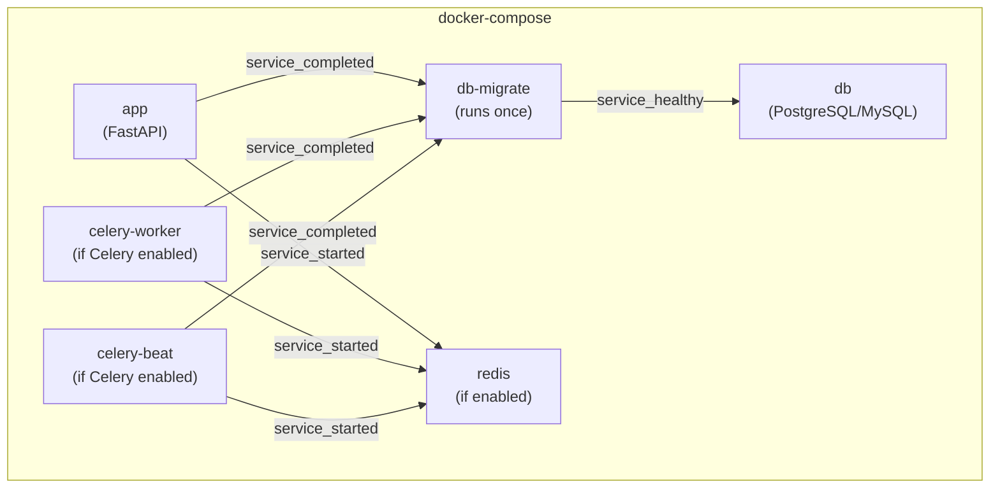

# Deployment

When Docker is enabled, Forge generates production-ready Docker configurations for your application.

## Generated Files

| File | Purpose |
|------|---------|
| `Dockerfile` | Application container image |
| `docker-compose.yml` | Multi-service orchestration |
| `.dockerignore` | Files to exclude from build |

## Docker Architecture

The generated `docker-compose.yml` includes these services:



Service startup order:
1. `db` starts first and waits until healthy
2. `db-migrate` runs migrations after database is healthy
3. `app`, `celery-worker`, and `celery-beat` start after migrations complete

## Dockerfile

The generated Dockerfile uses a Python slim image:

```dockerfile
FROM python:3.10-slim

WORKDIR /app

# Install system dependencies
RUN apt-get update && apt-get install -y gcc

# Install uv and Python dependencies
COPY pyproject.toml README.md alembic.ini ./
COPY alembic ./alembic
RUN pip install uv && uv sync --frozen

# Copy application
COPY ./app ./app
COPY ./secret ./secret

ENV PYTHONPATH=/app
EXPOSE 8000

CMD ["uvicorn", "app.main:app", "--host", "0.0.0.0", "--port", "8000"]
```

## Docker Compose Services

### Application Service

```yaml
app:
  build: .
  container_name: my_project
  ports:
    - "8000:8000"
  env_file:
    - ./secret/.env.production
  environment:
    - ENV=production
    - DATABASE_URL=postgresql+asyncpg://postgres:postgres@db:5432/my_project
  depends_on:
    db-migrate:
      condition: service_completed_successfully
  restart: unless-stopped
```

### Database Service

PostgreSQL:
```yaml
db:
  image: postgres:15-alpine
  environment:
    - POSTGRES_USER=postgres
    - POSTGRES_PASSWORD=postgres
    - POSTGRES_DB=my_project
  ports:
    - "5432:5432"
  volumes:
    - postgres_data:/var/lib/postgresql/data
  healthcheck:
    test: ["CMD-SHELL", "pg_isready -U postgres"]
    timeout: 20s
    retries: 10
```

MySQL:
```yaml
db:
  image: mysql:8.0
  environment:
    - MYSQL_ROOT_PASSWORD=mysql
    - MYSQL_DATABASE=my_project
  ports:
    - "3306:3306"
  volumes:
    - mysql_data:/var/lib/mysql
  healthcheck:
    test: ["CMD", "mysqladmin", "ping", "-h", "localhost"]
    timeout: 20s
    retries: 10
```

### Migration Service

Runs once on startup to apply database migrations:

```yaml
db-migrate:
  build: .
  command: sh -c "alembic revision --autogenerate -m 'Auto migration' && alembic upgrade head"
  depends_on:
    db:
      condition: service_healthy
```

### Redis Service

```yaml
redis:
  image: redis:7-alpine
  ports:
    - "6379:6379"
  restart: unless-stopped
```

### Celery Services

```yaml
celery-worker:
  build: .
  command: celery -A app.core.celery.celery_app worker --loglevel=info
  depends_on:
    - db-migrate
    - redis

celery-beat:
  build: .
  command: celery -A app.core.celery.celery_app beat --loglevel=info
  depends_on:
    - db-migrate
    - redis
```

## Deployment Steps

### 1. Configure Production Environment

Edit `secret/.env.production`:

```bash
# Update these values for production
JWT_SECRET_KEY=<generate-a-secure-random-key>
DATABASE_URL=postgresql+asyncpg://user:password@db:5432/mydb

# If using external services, update URLs
REDIS_CONNECTION_URL=redis://redis:6379
```

### 2. Build and Start

```bash
# Build images
docker-compose build

# Start all services
docker-compose up -d

# View logs
docker-compose logs -f app
```

### 3. Verify Deployment

```bash
# Check service status
docker-compose ps

# Test health endpoint
curl http://localhost:8000/health

# View API docs
open http://localhost:8000/docs
```

## Managing the Deployment

### View Logs

```bash
# All services
docker-compose logs -f

# Specific service
docker-compose logs -f app
docker-compose logs -f celery-worker
```

### Restart Services

```bash
# Restart all
docker-compose restart

# Restart specific service
docker-compose restart app
```

### Stop Services

```bash
# Stop all
docker-compose down

# Stop and remove volumes (deletes data)
docker-compose down -v
```

### Update Application

```bash
# Pull latest code, then:
docker-compose build app
docker-compose up -d app
```

## Production Considerations

### Security

1. **Change default passwords**: Update database and Redis passwords
2. **Use secrets management**: Consider Docker secrets or external vault
3. **Enable HTTPS**: Use a reverse proxy (nginx, traefik) with SSL
4. **Restrict ports**: Only expose necessary ports

### Performance

1. **Resource limits**: Set memory and CPU limits in docker-compose
2. **Connection pooling**: Tune database pool settings
3. **Worker scaling**: Adjust Celery worker concurrency

### Monitoring

1. **Health checks**: Use the `/health` endpoint
2. **Logging**: Configure log aggregation
3. **Metrics**: Add Prometheus/Grafana for monitoring

### Backup

1. **Database backups**: Use the built-in Celery backup task
2. **Volume backups**: Backup Docker volumes regularly

## Example: Production docker-compose Override

Create `docker-compose.prod.yml` for production-specific settings:

```yaml
version: '3.8'

services:
  app:
    deploy:
      resources:
        limits:
          memory: 512M
        reservations:
          memory: 256M
    logging:
      driver: "json-file"
      options:
        max-size: "10m"
        max-file: "3"

  db:
    deploy:
      resources:
        limits:
          memory: 1G
```

Use with:

```bash
docker-compose -f docker-compose.yml -f docker-compose.prod.yml up -d
```
